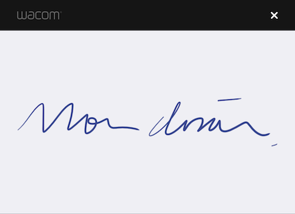

# Getting Started 

## Development environment

The *Wacom Ink SDK for signature* supports Wacom Bluetooth LE Styli using Bluetooth 4.0 LE, and the Apple Pencil.
This limits device support to the iPad with Retina Display (introduced 2012) and subsequent tablets for the Wacom Styli, and the iPad Pro range for the Apple Pencil.

The *Wacom Ink SDK for signature* supports iOS 10 or newer using Xcode 8.0 or above.
The framework is compiled for x86_64, arm7 and arm64 architectures.

In addition to the 'WacomSignatureSDK.framework' and 'WacomLicensing.framework' you also need to link your app against the 'libstdc++.dylib' and 'CoreBluetooth.framework' libraries and ensure that the Swift runtime libraries are included in your build target.

## Download the Wacom Ink SDK for signature

Download the SDK from https://developer.wacom.com/developer-dashboard

* Login using your Wacom ID
* Navigate to **Downloads for signature**
* Select **More info** on **WILL SDK for ink for iOS**
* Accept the End User License Agreement and select **Download** to use the SDK

The downloaded Zip file contains the SDK with documentation.

## Download an evaluation license

A license is needed to use the Wacom Ink SDK for signature and a fully functional evaluation license is free to download as follows:

* Navigate to https://developer.wacom.com/developer-dashboard
* login using your Wacom ID
* Select **Licenses**
* Select **New Evaluation License**
* Select **Generate Evaluation License** for Wacom Ink SDK for signature
* Return to Licenses where the new license file is ready for download
* Download the license file

The license is supplied as a JWT text string in a text file.
This will need to be copied into your application.
The self-service evaluation licenses have a three-month expiry date from the time of creation.
However you can generate a new license at any time.

## Install the Wacom Ink SDK for signature

To use the Wacom Ink SDK for signature in your project:

* Add the 'libc++.dylib' into the "Linked Frameworks and Libraries" list within the "General Settings" of the project build target
* Add 'CoreBluetooth.framework' into the "Linked Frameworks and Libraries" list within the "General Settings" of the project build target
* Drag the 'WacomSignatureSDK.framework' into the "Linked Frameworks and Libraries" list within the "General Settings" of the project build target
* Add the 'WacomSignatureSDK.framework' to the "Embedded Binaries" list within the "General Settings" of the project build target
* Drag the 'WacomLicensing.framework' into the "Linked Frameworks and Libraries" list within the "General Settings" of the project build target
* Add the 'WacomLicensing.framework' to the "Embedded Binaries" list within the "General Settings" of the project build target
* Import the '<WacomSignatureSDK/WacomSignatureSDK.h>' header
* Import the '#import <WacomLicensing/WacomLicensing-Swift.h> header 

Your project is now configured to use the Wacom Ink SDK for signature.

### Install the License

The *Wacom Ink SDK for signature* uses the standard Wacom License System provided by the WacomLicensing framework.
License keys (both evaluation and production) can be obtained from the Wacom Developer site at http://developer.wacom.com or from your Wacom account manager.
Evaluation keys will display a watermark on the signature capture windows, but enable full functionality until the license expiration date.
To load a license into the license system use the 'iniLicense method on the LicenseValidator's shared instance singleton:

(ObjC)
~~~Objective-C
@try {
    NSError *licenseError;
    [[LicenseValidator sharedInstance] initLicense:license error&err]; //Load license, where 'license' is your license string
    if(LicenseError != NULL) {
        //Porcess license error
    }
} @catch(NSException *e) {
    //Process generic license exception
}
~~~

## Guide to using the Wacom Ink SDK for signature in SWIFT
---

Swift’s compatibility with Objective-C allows you to use the Wacom Signature-SDK directly from Swift code with a minimal amount of configuration.
After configuring the Swift project, signature capture in the simplest form is:

~~~Swift
do {
    try LicenseValidator.sharedInstance.initLicense(licString) //Where licString is your license 
} catch let e {
  //Process license error
}

var sc = SignatureCapture(delelgate: self)
sc?.openCaptureWindowWithSignatory("who", andReason: "Why", boundToData: nil)
~~~

This code will produce a signature capture window with the signatory defined as 'Who' and a reason string of 'Why'.
Once the signature capture is complete, the SDK calls the relevant delegate method on the view controller.

### Configuring the SDK for use in SWIFT

To use the Wacom Ink SDK for signature in your project, you first need to copy and configure the resources:

* Add the 'libc++.dylib' into the "Linked Frameworks and Libraries" list within the "General Settings" of the project build target
* Add 'CoreBluetooth.framework' into the "Linked Frameworks and Libraries" list within the "General Settings" of the project build target
* Drag the 'WacomSignatureSDK.framework' into the "Linked Frameworks and Libraries" list within the "General Settings" of the project build target
* Add the 'WacomSignatureSDK.framework' to the "Embedded Binaries" list within the "General Settings" of the project build target
* Drag the 'WacomLicensing.framework' into the "Linked Frameworks and Libraries" list within the "General Settings" of the project build target
* Add the 'WacomLicensing.framework' to the "Embedded Binaries" list within the "General Settings" of the project build target

After configuration, you need to create a bridging header to expose the SDK to Swift.
Select "File > New > File > iOS > Header File" from the menu and create a new file named 'SDK-Bridging-Header.h'.
Open this file in XCode, add the following line of code and save the file:

~~~Objective-C
#import <WacomSignatureSDK/WacomSignatureSDK.h>
~~~

Finally you need to set the bridging header in the project settings.
Under the 'Build Settings' section of the project build target configuration, search for 'Objective-C Bridging Header'.
Under the 'Swift Compiler - Code Generation' section you should see 'Objective-C Bridging Header'.
Double click on the setting, then drag and drop the header into the pop-up window.
The SignatureObject, SignatureCapture and SigningView are now available directly from your Swift code.

### Licensing

The Wacom Ink SDK for signature uses the standard Wacom License System provided by the WacomLicensing framework.
License keys (both evaluation and production) can be obtained from the Wacom Developer site at http://developer.wacom.com or from your Wacom account manager.
Evaluation keys will display a watermark on the signature capture windows, but enable full functionality until the license expiration date.
To load a license into the license system use the 'iniLicense method on the LicenseValidator's shared instance singleton:

(Swift)
~~~Swift
import WacomLicensing

...

do {
    try LicenseValidator.sharedInstance.initLicense(licString) //Load license, where 'licString' is your license string
} catch let e {
    //Process license error 
}

~~~

### Basic Usage

Using the SDK from Swift is largely the same as using it from Objective-C:

* Import the WacomLicensing module 
* Load your license into the LicenseValidator singleton
* Implement the 'SignatureCapatureDelegate' protocol within your presenting view controller
* Instantiate a 'SignatureCapture' object with the appropriate delegate
* Call 'openCaptureWindowWithSignatory:andReason:boundToData:' to start the capture session

Once the session has completed, the SDK will call one of the following delegate methods:

~~~Swift
protocol SignatureCaptureDelegate {
    func signatureCapture(captureView :SignatureCapture!, completedWithSignature signature :SignatureObject!) -> Void
    func signatureCapture(captureView :SignatureCapture!, cancelledWithReason reason :SIGNATURE_CANCEL_REASON) -> Void
}
~~~

If the capture session was successful, then the 'signatureCapture:completedWithSignature' method is called with a newly created SignatureObject that contains the captured data.
If the session was unsuccessful, then the 'signatureCapture:cancelledWithReason' method is called with one of the following reasons:

~~~Swift
enum SIGNATURE_CANCEL_REASON  {
    case USER_CANCELLED, 
    case NO_SIGNATURE_DATA_CAPTURED,
    case CAPTURE_ABORTED,  
}
~~~

## Wacom Ink SDK for signature Demo Application
---

Under the 'Samples/Objective-C/SignatureExample' directory is a full sample iOS app that uses the Wacom Ink SDK for signature.
Simply double click the 'SignatureExample.xcodeproj' file to load the example into Xcode.
Click on Product->Run to build and run the example app.

A full working example of the 'Signature-SDK Demo App' written in  Swift is under the 'Samples/Swift' directory of the SDK distribution.
The functionality of this app is identical to that of the Objective-C sample described below.

## Guide to using the Wacom Ink SDK for signature Demo App

The example app serves as an example of how to use the Wacom Ink SDK for signature in a real iOS app.
The sample also includes some sample signatures in PNG, text and binary format, as well as two PDF documents to use as file hashes.
The app supports iTunes file sharing allowing access to the apps "Documents" folder within iTunes.
This allows you to examine the captured signature data on the host development system.
The app also supports 'Open in...' style functionality for PDF files.

### Main Toolbar

At the top of the screen is the app toolbar:

This controls navigation between the various screens of the demo app.
The toolbar buttons are as follows:

* **Open** Opens a file browser to allow the user to load a saved signature
* **Capture** Open the signature capture window with the signature settings
* **Render Image** Opens an UIImage view with a render of the signature data
* **Save Image** Opens a file browser to save a PNG version of the signature data
* **Reset Data** Clears all signature data and resets the demo app 
* **Signature Details** Displays the signature capture details 
* **Validate Signature** Displays the validation data of the signature
* **Attach file for hash** Opens a file browser allowing the user to choose a file to hash against
* **About** Displays the about screen showing version information

### Main View Controller

The main view controller is the first screen displayed when the app executes.
As well as the main toolbar, this screen contains four input text fields that control aspects of the signature capture and output, as well as seven buttons that control the colour used for the ink:

By default the "Why" and the "Who" fields are empty.
The contents of these two fields set the signatory and reason fields of the 'openCaptureWindowWithSignatory:andReason:boundToData:' method call.
If a file is selected for file hash using the toolbar icon, the method's "data" parameter contains an NSData version of the file.
If no file has been selected this parameter is nil.
The "Width" and "Height" fields set the width and height fields of the image output routines when "Do Not Scale" is *disabled*.
The colour buttons simply set the ink colour used for signature capture and display.

### Open File

The open file screen is a basic file browser that allows the user to open a saved signature file in .png, .txt or .fss format:

You can navigate folders by simply tapping on the folder.
Tapping on a file will set the "Enter Filename" field to the filename.
Tapping the "OK" button will load signature data from the named file, tapping the "Cancel" or cross will abort the file open routine.
If the file contains signature data, the main view controller's 'signatureObject' property will contain the loaded signature data.
If there is no signature data, or there is a file system error, the app will display an error message.

### Capture

Tapping on the capture icon will open the signature capture screen as provided by the Wacom Ink SDK for signature.
The "who" and "why" parameter are provided by the contents of the "Who" and "Why" fields of the main view controller.
The values set on the "Capture Settings" screen (see below) define the other capture options.

Here is an example capture screen with "Who" set to "Joe Bloggs" and "Why" set to "Bank Loan":

Displayed above the "Reason" label in the signature capture screen is the name of the licensed company if present.
Above the "Who" label the date field is automatically populated with today's date.

Below the "Who" label is the status label that displays the connection status of the Wacom Creative Stylus.
If the status line reads 'No Stylus Connected', you simply need to press the button on the stylus to connect it to the app.

### Render Image

The "Render Image" screen is a basic UIPopoverController that has an embedded UIImageView control:

The "signatureAsUIImageWithFlags:width:height:paddingX:paddingY:inkColor:backgroundColor:" method of the "SignatureObject" class sets the "image" property of the UIImageView.
The fields on the "Main View" controller set the width, height and ink colour of the image.
The values set in the "Capture Settings" screen set the image flags, paddingX and paddingY parameters of the method.
The image background is hard coded to [UIColor whiteColor], assuming that the "TRANSPARENT_BACKGROUND" image flag is *not* set.

### Save Image

The save image screen opens a file browser prompting the user to enter the output filename for a PNG render of the signature image:

The "writeSignatureToPNG:withFlags:width:height:paddingX:paddingY:inkColor:backgroundColor:" method of the "SignatureObject" class writes signature image to the output filename.
The app will prompt to overwrite any file already present.

### Signature Details

The "Validate Signature" screen displays the validation details of the loaded "Signature Object":

The "Who" and "Why" values are the values set on the "SignatureCapture" object at the time of capture.
The "When" field records the date and time that of signature capture.
The "Capture Details" section lists the extra data fields recorded at the point of capture:

* **Capture Area** The size in px of the total area used for signature capture
* **Signature Area** The size in px of the signature bounds
* **Digitizer** Details about the devices (iPad & Wacom Creative Stylus) used during capture
* **Driver** The SDK version used for capture
* **Machine OS** Details of the version of iOS and stylus driver used during capture

The "Integrity Details" section lists the hash type and integrity status for the loaded "SignatureObject".

**Note:** Use the "Attach File for Hash" screen to load a document hash and enable to document hashing options.

### Validate Signature

The "Validate Signature" button will pop-up an alert dialog that details the current validation statues of the loaded signature object.

### About

The about screen simply displays the SDK version information along with a human readable version of the license information:

### Further Reading

The "Signature Demo App" source code is fully documented with detailed descriptions of the method calls and processes required for signature capture.
Refer to the "Signature API Documentation" for detailed information of method calls to API objects.

----

